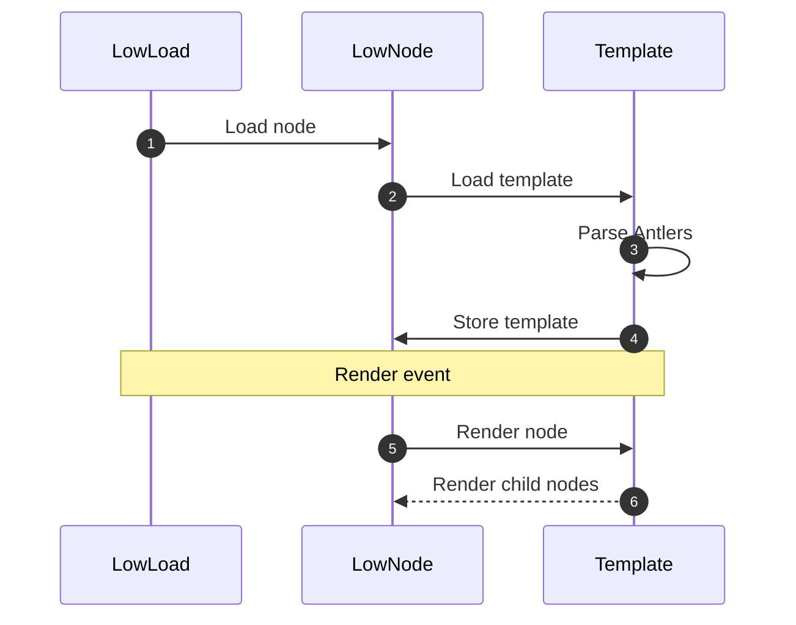

<{ :toc }>

## Syntax

Antlers uses two different sets of start and stop characters:
- 🦌 **Deerheads:** `<{` and `}>`
- 🖇 **Brackets:** `{` and `}`

> [!note]
> The `{}` Brackets syntax **escapes** HTML and only renders variables.  
> The `<{}>` Deerheads syntax renders variables and more *without* escaping HTML.

Unlike other templating languages which use syntax to distinguish between control flow and output, there is no difference in Antlers. In Antlers all constructs render output, even if that output is an empty string (`''`).

## Variables

Access an instance variable with:
```ruby
def render
  <html>{@user}</html>
end
```

**Variables can evaluate:**
1. An instance variable: `{@instance_var}` or `<{ @instance_var }>`
2. A method call/local variable: `{method_or_var}` or `<{ method_or_var }>`
3. A method chain: `{method_or_var.method}` or `<{ method_or_var.method }>`
4. A string: `{"String"}` or `<{ "String" }>`

> ![warn]
> Surround variables in HTML attributes with quotes to avoid the brackets being interpreted as deerheads.
> 
> ❌ Wrong: `<html class={var}>` - "Oh no I see a `}>`!"
> ✅ Correct: `<html class="{var}">` - "Phew it's just a `}`"

## Components

Render a [node](/docs/nodes) named `UserNode` with:
```ruby
def render
  <html><{ UserNode }></html>
end
```

ℹ️ The class referenced via `<{ MyClass }>` syntax must implement a `render` method.

**Props:**
```ruby
def render
  <html><{ UserNode user=@user }></html>
end
```

**Slots:**
```ruby
def render
  <html>
    <{ LayoutNode: }>
      <{ UserNode user=@user }>
    <{ :LayoutNode }>
  </html>
end
```

The `LayoutNode` would look like:
```ruby
class LayoutNode
  def render(event:)
    <header>...</header>
    <{ :slot }>
    <footer>...</footer>
  end
end
```

## Conditionals

```ruby
# Block.
<{ if: @user.happy? }>
  <{ UserNode user=@user }>
<{ :if }>

# Directive. [UNRELEASED]
<{ UserNode user=@user if: @user.happy? }>
```

## Loops

```ruby
# Block.
<{ for: user in: @users }>
  <{ UserNode user=user }>
<{ :for }>

# Directive. [UNRELEASED]
<{ UserNode user=user for: user in: @users }>
```

ℹ️ You can iterate a hash with `for: key, value` syntax.

## Forms

Forms can be created in a compositional way, mixing both Antlers syntax with regular form elements:

```ruby
<{ form: '/submit' }>
  <input type="submit" value="Submit">
<{ :form }>
```

Antlers generates additional markup behind the scenes:
- Sets the form's `action` to `/submit`
- Sets the form's `method` to `POST`
- Adds an anti-forgery token to prevent CSRF [UNRELEASED]

Change the `POST` method to `GET` with:

```ruby
<{ form: '/search' method: 'GET' }>
  <input type="search">
  <input type="submit" value="search">
<{ :form }>
```

Forms can be created in a compositional way, mixing both Antlers syntax with regular form elements:

```ruby
<{ form: '/submit' }>
  <input type="submit" value="Submit">
<{ :form }>
```

Antlers generates additional markup behind the scenes:
- Sets the form's `action` to `/submit`
- Sets the form's `method` to `POST`
- Adds an anti-forgery token to prevent CSRF [UNRELEASED]

Change the `POST` method to `GET` with:

```ruby
<{ form: '/search' method: 'GET' }>
  <input type="search">
  <input type="submit" value="search">
<{ :form }>
```

### Label [UNRELEASED]

`<{ label: 'Label' }>`

### Search [UNRELEASED]

`<{ search: :query }>`

### Submit [UNRELEASED]

`<{ submit: 'Search' }>`

### Parallelism [UNRELEASED]

Add parallelism where it makes sense and you can measure the performance outcome and keep data integrity.

**Per sibling:**
```ruby
def render
  # Both child nodes executed at the same time.
  <{ parallelize: }>
    <{ UserNode user=@user }>
    <{ PostsNode posts=@posts }>
  <{ :parallelize }>
end
```

**Per block:**
```ruby
def render
  # Each UserNode rendered at the same time.
  <{ map: user in: @users :parallelize }>
    <{ UserNode user=user }>
  <{ :map }>
end
```

**Per directive:**
```ruby
<{ UserNode user=user for: user in: @users :parallelize }>
```

## Translations

Variables (`{}`) are also useful for embedding text in RBX without any syntax highlighting issues:
```ruby
def render
  <html>{"I'm just a string"}</html>
end
```
Text entered this way can be translated based on region, language or any arbitrary condition. [UNRELEASED]

## Full Examples

### Slot

```ruby
class UserNode < LowNode
  def initialize
    @user = User.new(username: "Random User", bio: "I'm a person!")
  end
  
  def render
    <html>
      <{ LayoutNode: title=@user.username }>
        {@user.bio}
      <{ :LayoutNode }>
    </html>
  end
end
```

The `LayoutNode` would look like:
```ruby
class LayoutNode
  def render(event:, title:)
    <header>...</header>
    <h1>{title}</h1>
    <{ :slot }>
    <footer>...</footer>
  end
end
```

The result would be:
```HTML
<header>...</header>
<h1>Random User</h1>
<p>I'm a person!</p>
<footer>...</footer>
```

## Architecture

Antlers creates an Abstract Syntax Tree composed of the following `AntlerNode`s:

**Leaf nodes:**
- `PropNode`
- `VarNode`

**Branch nodes:**
- `RootNode`
- `SlotNode`
- `YieldNode` - Renders `AntlerNode`s inside a `SlotNode`


